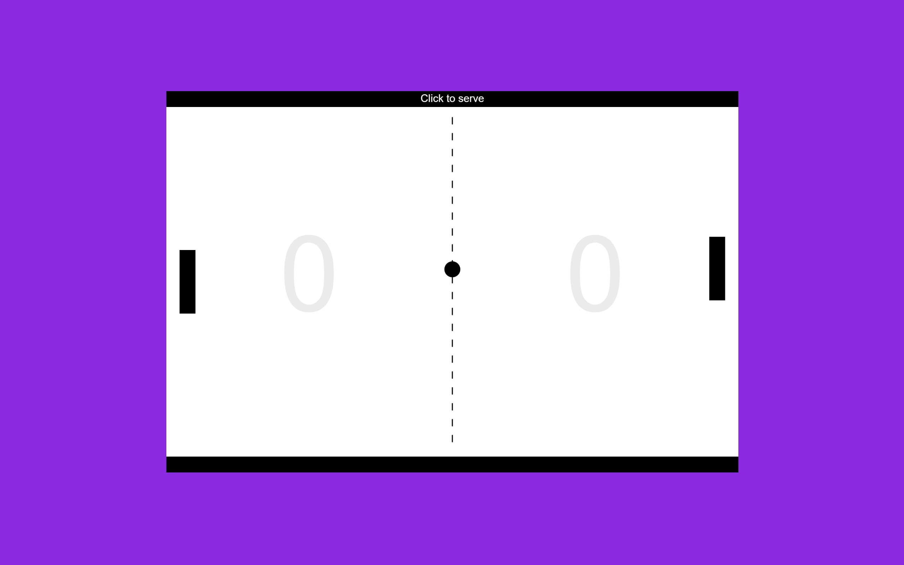

## Voluntarism

Voluntarism says that our actions and choices are driven mainly by **willpower** (desire, intention, or determination) rather than by **logical thinking or understanding**.

## Personal Interpretation of the Chosen “Ism”

Every **-ism** has beliefs or ideas related to one of these — philosophy, politics, or morality.

**Examples:**

- **Capitalism** → belief in private ownership and free markets.  
- **Humanism** → belief in human value and reason.  
- **Voluntarism** → belief that willpower dominates intellect.

## Gamifying Pong with Voluntarism

Voluntarism says that our actions and choices are driven mainly by **willpower** (desire, intention, or determination) rather than by **logical thinking or understanding**.

### Rules to Add or Change for Implementing Voluntarism

- Since **Voluntarism** emphasizes individual action, I want to make it a **single-player game**, where the player competes against the system.  
- As Voluntarism suggests that actions are driven by **willpower rather than logic**, I will **swap the key controls** of the player:
  - The **right key** will make the player move **left**.  
  - The **left key** will make the player move **right**.  

This change will encourage the player to rely on their **willpower and determination** to adapt, rather than on **logical understanding** or routine control patterns.

### Note to the Player

Welcome to **Pong: The Voluntarism Edition**

This version of Pong is inspired by the philosophical idea of **Voluntarism** —  
the belief that our actions and choices are driven mainly by **willpower** rather than by **logic or reasoning**.

In this game, the **controls are intentionally reversed** —  
pressing the **right key** moves you **left**, and the **left key** moves you **right**.  
This twist is designed to challenge your instincts and test your **determination**.

My vision for this version is to make you **feel the power of will** —  
to remind you that sometimes, success doesn’t come from perfect logic,  
but from **adaptation, persistence, and pure willpower**.  

So, play not with your mind — play with your **will**.

